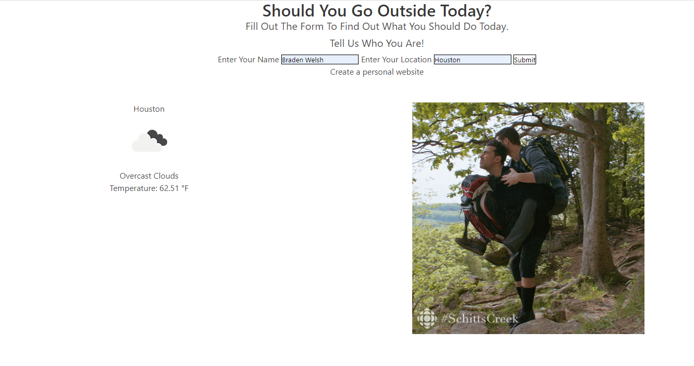

# ProjectUno
## **Should I go outside?**
### This project lets the user see if the weather outside is at the right temperature  to go outside or not, and if the webisite should find it to be too cold or hot outside it will generate a activity to do while indoors.ffdgdfsg 
