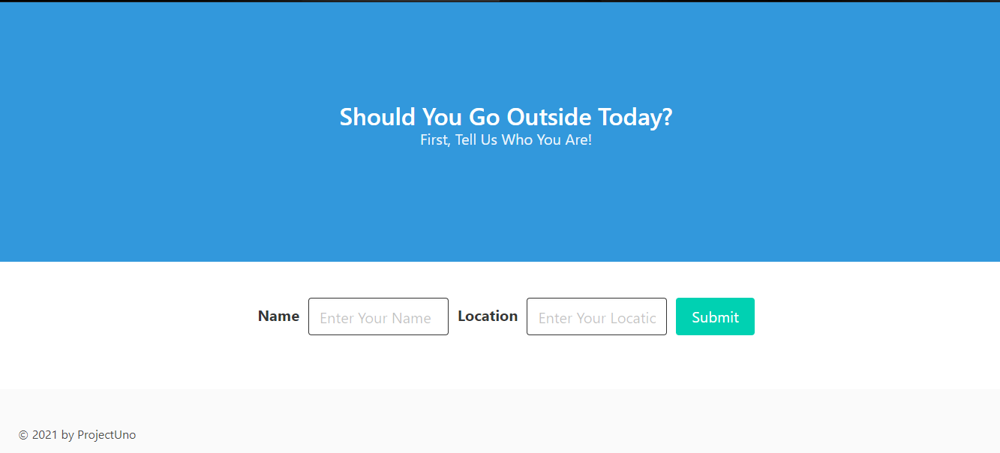

# ProjectUno
## **Should I go outside?**
### This project lets the user see if the weather outside is at the right temperature  to go outside or not, and if the webisite should find it to be too cold or hot outside it will generate a activity to do while indoors. For the code we used bulma in the html to add style to our website aside from css, we also used javascript to add GIFs and icons to show what the weather is looking like outside

